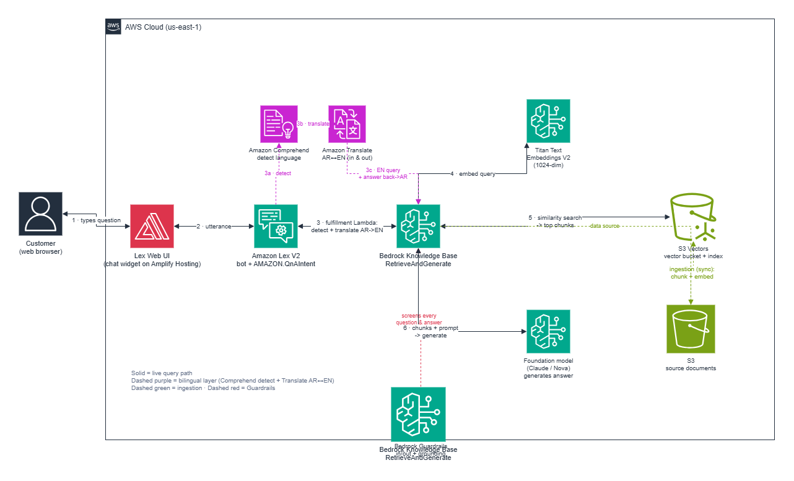

# Meridian Support Chatbot (bilingual AR/EN)

A buildable customer-support chatbot for a fictional GCC real-estate company:
**Amazon Lex → Bedrock Knowledge Base (S3 Vectors) → Claude**, made bilingual
with **Amazon Comprehend + Amazon Translate** (one English KB, translated at
the edges), guarded by **Amazon Bedrock Guardrails**, embedded in a demo
website with a short answer-then-offer conversational flow.

Two ways to stand it up, side by side:
- **CloudFormation** (`infra/template.yaml`) for everything automatable.
- **Manual console runbook** (`runbook/BUILD.md`) for the parts that aren't
  (S3 Vectors bucket/index, and the Lex bot + QnAIntent).

## Architecture



*Amazon Lex (QnAIntent) → Comprehend detect → Translate AR↔EN → Bedrock Knowledge Base (S3 Vectors) → Claude, with Bedrock Guardrails on the answer. Editable source: `docs/architecture.drawio`.*

## What's automated vs manual

| Piece | How |
|---|---|
| S3 Vectors bucket + index | `scripts/00-bootstrap-vectors.sh` (no CFN type yet) |
| Bedrock model access (Titan V2 + Claude) | manual — runbook step 1 |
| Source S3 bucket, KB, data source | CloudFormation |
| Bedrock Guardrail (grounding + PII) | CloudFormation |
| Translate/Comprehend fulfillment Lambda | CloudFormation |
| Doc upload + ingestion | `scripts/01-deploy.sh`, `scripts/add-doc.sh` |
| Lex bot + QnAIntent + alias | manual — runbook step 4–5 (not CFN-native) |
| Lex Web UI widget | manual — AWS prebuilt template |

## Quick start

```bash
# 0. vector store (prints the two ARNs you pass next)
./scripts/00-bootstrap-vectors.sh

# 1. enable Titan V2 + Claude in the Bedrock console (runbook step 1)

# 2. deploy stack + upload docs + start ingestion
./scripts/01-deploy.sh <VectorBucketArn> <VectorIndexArn>

# 3. confirm the KB answers in the Bedrock test panel (runbook step 3)
# 4. build the Lex bot + QnAIntent, wire the fulfillment Lambda (runbook step 4)
# 5. deploy the Lex Web UI, point site/index.html at it (runbook step 5)
```

## Add a document later

```bash
./scripts/add-doc.sh path/to/new-policy.pdf
```
Uploads to the source bucket and re-syncs the KB. No redeploy, no Lex change.

## Layout

```
infra/template.yaml        CloudFormation: KB + S3 Vectors + guardrail + fulfillment Lambda
scripts/00-bootstrap-vectors.sh   pre-create the vector bucket + index
scripts/01-deploy.sh              deploy + upload docs + ingest
scripts/add-doc.sh                manually add one more document
BUILD.md           the manual console steps (Lex, model access, Web UI)
docs/*.pdf                 3 English KB source documents
docs/architecture.png      rendered architecture diagram
index.html            bilingual demo site (toggle, RTL, short flow)
```

## Bilingual design (the AWS pattern)

One English KB. At runtime the fulfillment Lambda runs Comprehend
(detect) → Translate (AR→EN) → RetrieveAndGenerate → Translate (EN→AR).
One document set to maintain; see the architecture diagram above.

## Note

Guardrail/KB/S3-Vectors resource shapes and the Lex QnAIntent flow are recent
and evolving. cfn-lint passes here; if a property is rejected at deploy time,
check the current Bedrock CFN reference — the runbook's console path is the
fallback for anything the template can't yet express.
